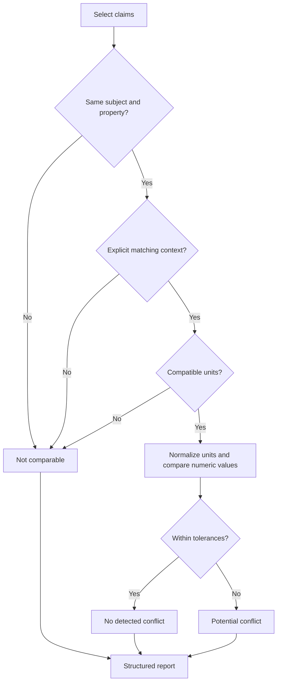

# Conflict Detection

```mermaid
flowchart TD
    A[Select claims] --> B{Same subject and property?}
    B -->|No| N[Not comparable]
    B -->|Yes| C{Explicit matching context?}
    C -->|No| N
    C -->|Yes| U{Compatible units?}
    U -->|No| N
    U -->|Yes| V[Normalize units and compare numeric values]
    V --> T{Within tolerances?}
    T -->|Yes| OK[No detected conflict]
    T -->|No| P[Potential conflict]
    N --> R[Structured report]
    OK --> R
    P --> R
```

[Mermaid source](conflict-detection.mmd)
