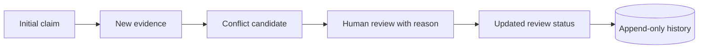

# Knowledge Timeline

```mermaid
flowchart LR
    A[Initial claim] --> E[New evidence]
    E --> C[Conflict candidate]
    C --> H[Human review with reason]
    H --> S[Updated review status]
    S --> ADB[(Append-only history)]
```

[Mermaid source](human-review.mmd)
