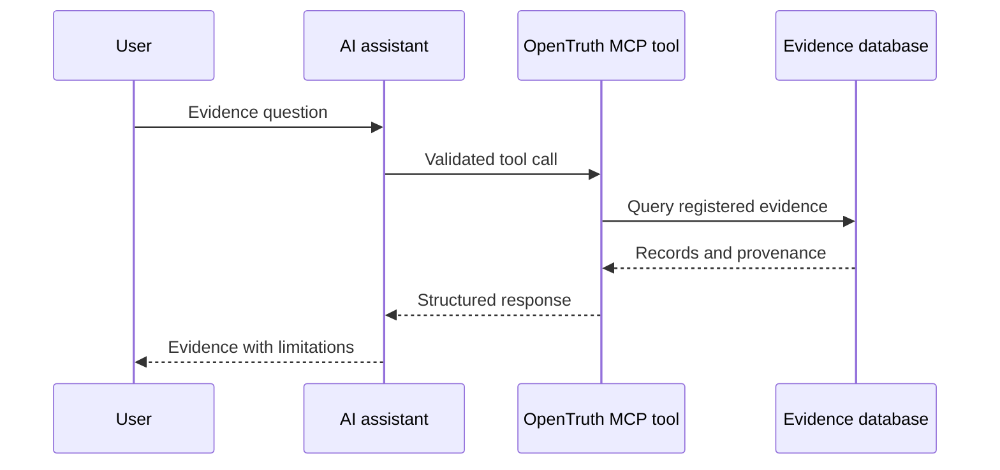

# MCP Interaction

```mermaid
sequenceDiagram
    participant User
    participant Assistant as AI assistant
    participant MCP as OpenTruth MCP tool
    participant DB as Evidence database
    User->>Assistant: Evidence question
    Assistant->>MCP: Validated tool call
    MCP->>DB: Query registered evidence
    DB-->>MCP: Records and provenance
    MCP-->>Assistant: Structured response
    Assistant-->>User: Evidence with limitations
```

[Mermaid source](mcp-interaction.mmd)
