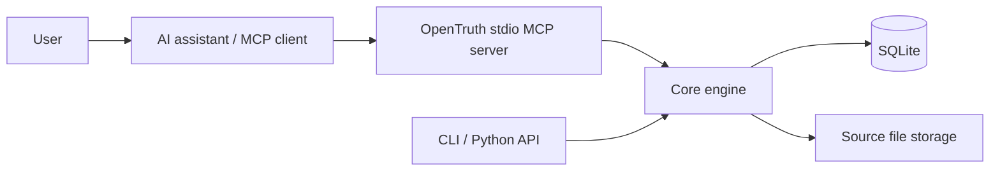

# OpenTruth System Architecture

```mermaid
flowchart LR
    User --> Client[AI assistant / MCP client]
    Client --> Server[OpenTruth stdio MCP server]
    Server --> Core[Core engine]
    CLI[CLI / Python API] --> Core
    Core --> DB[(SQLite)]
    Core --> Files[Source file storage]
```

[Mermaid source](system-architecture.mmd)
